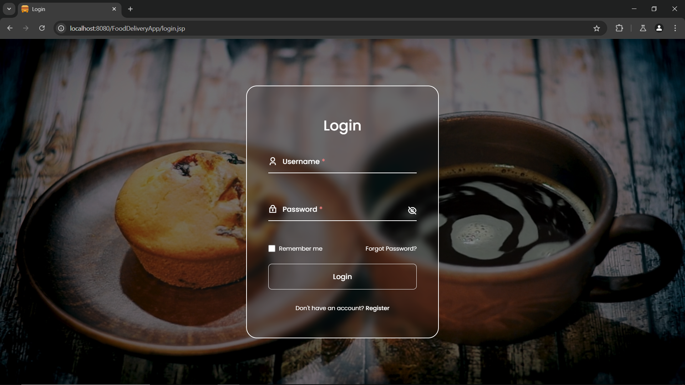
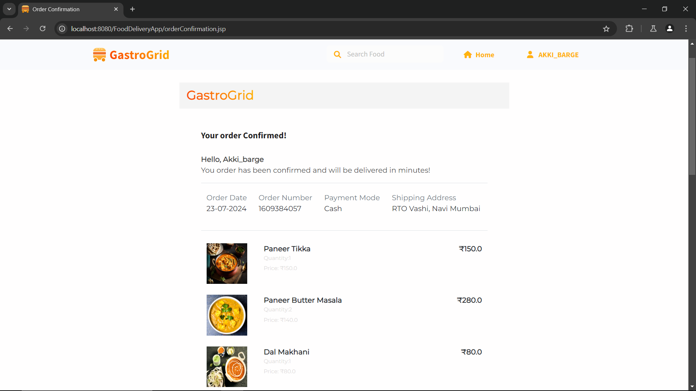

# GastroGrid: A Food Delivery Web Application

## Introduction

GastroGrid is a dynamic food delivery web application that connects users with their favorite restaurants and dishes. It offers a seamless experience from browsing restaurant menus to placing orders, making it convenient for users to enjoy delicious food from the comfort of their homes.

## Features

- **Home Page:** Displays a welcoming section, featured restaurants, menu items, cuisine types, and a footer with top cities, company info, social links, and a newsletter subscription.

- **Restaurant Page:** Dynamically lists all restaurants from the database, allowing users to explore different dining options.

- **Menu Page:** Displays menu items based on the selected restaurant, enabling users to browse and select dishes.

- **Cart Functionality:** Users can add items to the cart, update quantities, remove items, and proceed to checkout.

- **Checkout Page:** Collects address and payment details, then provides an order summary with menu details, total amount, order date, order ID, and payment mode.

- **Authentication:** Includes login and signup pages with password hashing using the Bcrypt algorithm, ensuring secure user authentication and validation.

- **Newsletter Subscription:** Allows users to subscribe to a daily newsletter for updates and promotions.

## Technologies Used

### Frontend

- **JSP (JavaServer Pages):** For dynamic web content generation.
- **JavaScript:** To enhance interactivity and client-side validation.
- **CSS:** For styling and layout design.
- **Bootstrap:** To create responsive and modern user interfaces.

### Backend

- **Java:** Core programming language for the application logic.
- **JDBC (Java Database Connectivity):** For connecting and executing queries with the MySQL database.
- **Servlet:** To handle HTTP requests and responses.
- **JSTL (JavaServer Pages Standard Tag Library):** To simplify JSP development and manage data presentation.

### Database

- **MySQL Workbench:** For database design, management, and querying.

### APIs

- SheetDB API for newsletter subscriptions

### Security

- Bcrypt for password hashing

## Demo

### Video Demo

Watch the full demo of GastroGrid in action:

### Screenshots

#### Login Page

#### SignUp Page

#### Home Page

#### Restaurant Page

#### Menu Page

#### Cart Functionality

#### Checkout Page

#### OrderConfirmation Page

## ER Diagram

[

## Contact

For any questions, feedback, or support, please contact:

- **Akshay Barge:** [akshaybarge315@gmail.com](mailto:akshaybarge315@gmail.com)
